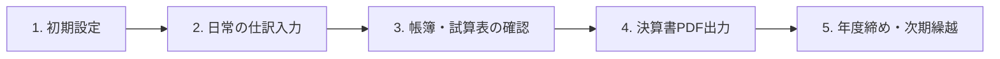

# STEN-F (Simple Tough Effective Next-generation Finance)

[](https://github.com/bottiLLC/STEN-F/actions/workflows/ci.yml)

[](https://www.gnu.org/licenses/gpl-3.0)
[](https://www.python.org/)
[](https://reflex.dev/)

**STEN-F** は、既存のクラウド会計ソフト（SaaS）によるデータの囲い込みや高額なサブスクリプションから開発者・中小企業・個人事業主を解放するために生まれた、**100% Pure Python 製のオープンソース経理・会計アプリケーション**です。

モダンな Web フロントエンド/バックエンドを Python だけで記述できる **Reflex** を GUI フレームワークに採用し、堅牢な **Clean Architecture（クリーンアーキテクチャ）** に基づいて設計されています。すべてのデータはローカルの SQLite（非同期 SQLAlchemy 2.0）に保存され、財務データの完全な主権を手元に保持できます。

---

## 🏴 開発・運用哲学 (Philosophy)

1. **This is your Stengun (これはステンガンだ):** シンプルで、タフで、実戦で勝つための武器（[ステン短機関銃](https://ja.wikipedia.org/wiki/%E3%82%B9%E3%83%86%E3%83%B3%E7%9F%AD%E6%A9%9F%E9%96%A2%E9%8A%83)）のように、過剰な装飾を削ぎ落とした強靭で壊れにくいシステムを目指します。
2. **Of course it's free (当然無料だ):** 基礎的な経理・会計ソフトウェアは、自らの手でホストでき、完全に無償であるべきです。
3. **No Vendor Lock-in (ベンダーロックインの排除):** あなたの財務データは人質ではありません。生の SQL や Python スクリプトからいつでも瞬時にアクセス・抽出可能であるべきです。
4. **Local First (ローカルファースト):** 外部のネットワーク障害や SaaS のサービス終了に怯える必要はありません。データもアプリケーションも手元のマシンで動き続けます。
5. **Don't pay for apps, pay for AI (アプリではなくAIに払う):** 毎月の固定利用料を支払うのではなく、業務を真に自動化・高速化する「AI推論（レシートOCRによる仕訳候補抽出）」の従量制 API 利用料に直接支払うべきです。

---

## ⚡ 主な機能一覧 (Features)

### 1. 仕訳入力・帳簿管理
* **高速キーボードフレンドリー仕訳入力:** 貸借金額のリアルタイム自動バランス検証、ショートカット、自動補完を備えた直感的な入力 UI。
* **連続入力モード:** 入力内容を保持したまま複数枚の領収書を連続で登録可能。
* **仕訳帳（履歴）ビュー & CSV 出力:** 取引日、取引先、摘要、勘定科目での複合検索・フィルタリング、およびワンクリックでの CSV エクスポート。
* **期首残高（B/S）設定:** 会計年度開始時の資産・負債・純資産の残高を、貸借対照表の完全一致検証付きで設定。

### 2. 電子帳簿保存法 & インボイス制度対応
* **変更履歴の監査証跡（論理削除）:** 電帳法の訂正・削除履歴要件に対応。削除された仕訳は物理削除されず論理削除マーク（`is_deleted`）され、履歴追跡が可能。
* **適格請求書（インボイス）T番号管理:** 取引先ごとに T+13桁の事業者登録番号をマスタ管理し、仕訳時に自動関連付けと形式バリデーションを実施。
* **証憑ファイルの保存・ダウンロード:** 領収書や請求書（PDF・画像）を規則的なファイル名（`日付_取引先_金額.拡張子`）でローカルストレージへ安全に保存し、仕訳履歴からいつでもダウンロード・プレビュー可能。

### 3. 財務レポート・決算書 PDF 生成
* **合計残高試算表 (Trial Balance):** 借方・貸方の合計および残高をリアルタイム集計。
* **貸借対照表 (B/S) & 損益計算書 (P/L):** 各勘定科目の残高と当期純利益を自動計算。
* **総勘定元帳 (General Ledger):** 勘定科目ごとにドリルダウンし、期中取引推移を時系列で把握。
* **決算書 PDF の非同期出力:** 重たい帳票 PDF 生成処理をバックグラウンドへオフロードし、UI をブロックせず快適に出力。
* **年度締め・次期繰越 (Fiscal Year Closing):** 期末の利益剰余金振替および次期開始残高の自動繰越、締め済み年度の編集ロック保護。

### 4. 🤖 AI OCR 自動仕訳 (Powered by OpenAI GPT)
* **最新推論モデル対応:** `gpt-5.6-terra` などの高精度推論モデルに対応（モデルや推論深度は `.env` でカスタマイズ可能）。
* **PDF / 画像ネイティブ対応:** PyMuPDF (`fitz`) による PDF 1 ページ目の自動画像化、および長辺・DPI の自動最適化圧縮によるトークンコスト削減。
* **ハイブリッド取引先マッチング:** 読み取りテキストから法人格（株式会社等）を除去して既存マスタと曖昧照合。登録済み取引先の一致時は T番号や推奨科目を自動適用。
* **役員借入金・立替金優先ルール:** 小規模法人・個人事業主の実態に合わせ、役員立替時の「役員借入金」優先ルールや勘定科目推論プロンプトを内蔵。
* **自己修復型バリデーション:** 消費税額の再計算（税率・税抜金額の整合性チェック）やインボイス番号の書式検証を自動実行。

### 5. システム管理・バックアップ
* **ワンクリック・データベースバックアップ:** アプリ画面から指定したフォルダへデータベース（SQLite）および設定ファイル（`.env`）をタイムスタンプ付きで自動退避。
* **マスタデータ管理:** 勘定科目、取引先、よく使う摘要、会計年度、自社情報の一括設定。

---

## 🚀 セットアップと起動方法 (Getting Started)

### 1. 必要環境
* **Python 3.14 以上**
* **uv (Astral)** がインストールされていること（推奨）

### 2. インストール
リポジトリをクローンし、依存関係をインストールします。

```bash
git clone https://github.com/bottiLLC/STEN-F.git
cd STEN-F
uv sync
```

### 3. 環境設定 (.env)
プロジェクトルート直下に `.env` ファイルを作成します（`.env.sample` を複製して作成できます）。

```ini
# データベース接続文字列（SQLite）
DATABASE_URL=sqlite+aiosqlite:///bookkeeping.db

# OpenAI API Key（AI OCR 機能を利用する場合に設定）
OPENAI_API_KEY=sk-proj-...

# OpenAI モデル設定（用途や予算に応じて変更可能）
OPENAI_DEFAULT_MODEL=gpt-5.6-terra
OPENAI_REASONING_EFFORT=high
```

### 4. アプリケーションの起動

#### Windows の場合
プロジェクトルートの `run.bat` をダブルクリックするだけで起動できます。
（初回は自動的に仮想環境の構築が行われ、ブラウザで `http://localhost:3000` が開きます）

#### macOS / Linux の場合
```bash
chmod +x start.command
./start.command
```

#### コマンドラインから直接起動する場合
```bash
uv run reflex run
```

起動後、ブラウザで `http://localhost:3000`（フロントエンド）にアクセスしてください。

---

## 📖 経理業務の基本的な使い方 (Workflow)



### ステップ 1: 初期設定（マスタ管理 & 期首残高）
1. 画面左メニューの **「マスタ管理」** を開きます。
2. **「自社情報」**: 法人名（または屋号）、インボイス登録番号を設定します。
3. **「会計年度」**: 現在の事業年度（例: 第1期 2026-04-01 〜 2027-03-31）を登録します。
4. **「期首BS」画面**: 前期末からの繰越残高（現金、普通預金、資本金など）を入力し、貸借が一致した状態で「期首残高を登録する」をクリックします。

### ステップ 2: 日常の仕訳入力
1. **「仕訳入力」** 画面を開きます。
2. **手動入力の場合**:
   * 取引日、摘要（よく使う摘要リストから選択または直接入力）、取引先、登録番号（T番号）を入力します。
   * 勘定科目、借方金額、貸方金額を入力します（「+ 行を追加」で複合仕訳にも対応）。
   * 取引先をマスタに保存したい場合は「取引先マスタに登録/更新する」にチェックを入れます。
   * 「登録する」ボタンをクリックします。
3. **AI OCR を利用する場合**:
   * 画面上部の「領収書・請求書をアップロード」エリアに PDF またはレシート画像をドラッグ＆ドロップします。
   * AI が日付・金額・取引先・インボイス番号・勘定科目を自動抽出し、フォームへ自動入力されます。
   * 内容を確認・修正して「登録する」をクリックすると、証憑ファイルが自動で `storage/` フォルダへ保存され、仕訳に紐付けられます。

### ステップ 3: 帳簿・試算表の確認
* **「仕訳帳 (履歴)」タブ**: 登録した仕訳の一覧を確認・検索・削除（論理削除）できます。「CSVエクスポート」で全件出力可能です。
* **「財務諸表」画面**: 試算表、B/S、P/L、総勘定元帳を切り替えながら、残高や推移をリアルタイムに確認します。

### ステップ 4: 決算書 PDF の出力
* **「財務諸表」** 画面の「決算書PDFを出力」ボタンをクリックすると、バックグラウンドで帳票 PDF が生成され、ダウンロードできます。

### ステップ 5: 年度締め (Fiscal Year Closing)
1. **「マスタ管理」→「会計年度」** タブを開きます。
2. 該当年度の「年度を締める」ボタンをクリックします。
3. 次期の事業年度名を入力して実行すると、当期純利益が繰越利益剰余金へ自動振替され、次期の期首残高が自動生成されます（締められた旧年度はロックされ、誤修正が防止されます）。

---

## 🧰 データのバックアップとリストア手順 (Backup & Restore)

STEN-F はローカルファーストで動作するため、PC の故障やデータ紛失に備えて**定期的なバックアップ**を行うことが極めて重要です。

### 1. バックアップ対象のデータ

| 対象 | パス（デフォルト） | 内容 |
| :--- | :--- | :--- |
| **データベース** | `bookkeeping.db`（または `data/sten_f.db`） | すべての仕訳、マスタ設定、変更履歴データ |
| **証憑ファイル** | `storage/` フォルダ | 仕訳に紐付けられた領収書・請求書の PDF および画像ファイル |
| **設定ファイル** | `.env` | OpenAI API キーや接続設定 |

---

### 2. バックアップ方法

#### 方法 A: 画面からのワンクリックバックアップ（DB & 設定ファイル）
1. STEN-F の画面から **「マスタ管理」→「システム」** タブを開きます。
2. 「バックアップ保存先」を確認（または「フォルダ選択」で外部ドライブやバックアップ用フォルダを指定）します。
3. **「バックアップ実行」** ボタンをクリックします。
4. 指定したフォルダ内に `YYYYMMDD_HHMMSS/` 形式のタイムスタンプ付きフォルダが作成され、データベースファイル（`-wal`, `-shm` を含む）および `.env` が自動的にコピー・退避されます。

> [!IMPORTANT]
> **証憑 PDF / 画像ファイル（`storage/` フォルダ）のバックアップについて**
> 電子帳簿保存法に対応して蓄積された領収書・請求書ファイルは `storage/` フォルダに保存されます。ファイルサイズが大きくなるため、画面からの DB バックアップと併せて、**`storage/` フォルダごと外付け HDD、NAS、またはクラウドストレージ（Google Drive / OneDrive / Dropbox 等）へ定期的にコピー・同期保存**してください。

#### 方法 B: 手動での完全バックアップ（推奨）
アプリケーションを停止した状態で、以下のファイル・フォルダを別の安全なストレージへ丸ごとコピーします。

```text
STEN-F/
├── bookkeeping.db   # (または data/sten_f.db) ★必須
├── storage/         # ★必須: すべての証憑 PDF・画像ファイルが格納されているフォルダ
└── .env             # ★必須: APIキー・環境設定ファイル
```

---

### 3. リストア（復旧・別 PC へのデータ移行）手順

マシントラブルからの復旧時や、新しい PC へ環境を移行する際の手順です。

1. **移行先 PC での準備**:
   * Python 3.14+ および `uv` をインストールします。
   * リポジトリをクローンまたはソースコードを展開し、`uv sync` で環境をセットアップします。
2. **アプリケーションの完全停止**:
   * STEN-F が起動している場合は、ターミナルおよびブラウザを**完全に終了**させてください。
3. **バックアップデータの配置（上書きコピー）**:
   * 退避させておいた **`bookkeeping.db`**、**`.env`**、および **`storage/` フォルダ** を、移行先プロジェクトのルートディレクトリに上書き配置します。
4. **起動と動作確認**:
   * `run.bat`（または `uv run reflex run`）で起動します。
   * 「仕訳帳 (履歴)」画面で過去の仕訳が表示されること、および「証憑」欄のアイコンから PDF / 画像ファイルが正常にダウンロード・プレビューできることを確認します。

---

## 🧪 開発・テスト手順 (Testing)

STEN-F は CI/CD パイプラインと連携した厳格な品質管理を行っています。

```bash
# 全単体テスト・結合テストの実行
uv run pytest

# カバレッジ測定付きテスト実行
uv run pytest --cov=app --cov-report=term-missing

# ファズテスト（Hypothesis によるプロパティテスト）の実行
uv run pytest -m "fuzz"

# 静的型チェック（mypy）
uv run mypy app tests

# コードフォーマット・静的解析（ruff）
uv run ruff check app tests
uv run ruff format --check app tests
```

---

## 🏗 アーキテクチャ構成 (Clean Architecture)

```text
app/
├── app.py              # Reflex エントリポイント
├── config.py           # Pydantic Settings 設定管理 (.env)
├── container.py        # 依存関係注入 (Dependency Injection)
├── core/               # 共通ユーティリティ (Logging, Resilience)
├── domain/             # ドメイン層 (Pydantic V2 モデル、インターフェース)
│   ├── constants/      # 会計定数・税率定義
│   ├── interfaces/     # リポジトリ抽象インターフェース
│   ├── models/         # 仕訳・勘定科目・年度・領収書ドメインモデル
│   └── prompts/        # OpenAI OCR 推論プロンプト
├── infrastructure/     # インフラ層 (外部サービス、DB、リポジトリ具象実装)
│   ├── db/             # SQLAlchemy ORM モデル、セッション管理
│   ├── external/       # OpenAI OCR, PDF 生成, バックアップ, ファイル保存
│   └── repositories/   # データアクセス具象実装
├── application/        # アプリケーションサービス層 (ユースケース)
│   └── services/       # 仕訳・元帳・マスタ・決算サービス
└── ui/                 # プレゼンテーション層 (Reflex SPA)
    ├── pages/          # 画面ルーティング
    ├── components/     # UI コンポーネント
    ├── di.py           # UI からのサービス解決
    └── view_models/    # Reflex State (SubStates パターン)
```

---

## 📜 ライセンス (License)

Copyright (C) 2026 合同会社ぼっち (bottiLLC)

本ソフトウェアは **GNU General Public License v3.0 (GPL-3.0)** の下で公開されています。
* 改変・商用利用を含むすべての目的で、完全無償でご使用いただけます。
* **コピーレフト義務:** 本ソフトウェア（または改変した派生物）を再配布する場合、またはネットワーク越しにサービスとして提供する場合は、**そのソースコード全体を GPL-3.0 ライセンスの下で一般公開する義務**が生じます。

詳細は [LICENSE](file:///e:/Python/STEN-F/LICENSE) ファイルをご確認ください。

---

## ⚠️ 免責事項・税務リスクに関する警告 (Disclaimer)

> [!CAUTION]
> **本システムをご利用いただく前に、必ず以下の免責事項をお読みください。本システムの利用を開始した時点で、以下の事項にすべて同意したものとみなされます。**
> 
> 1. **現状有姿の提供:** 本システムは「現状有姿 (AS IS)」で提供され、動作の完全性、特定の税務目的への適合性、法令への完全な準拠について、明示的・黙示的を問わず一切の保証を行いません。
> 2. **利用者の自己責任:** 本システムは電子帳簿保存法やインボイス制度への対応を支援する機能を備えていますが、帳簿作成の適法性、入力された数値・仕訳の正確性、税務申告の妥当性については、**すべて利用者が自己の責任において確認・判断するものとします**。
> 3. **損害の免責:** システムの不具合、データ消失・破損、税務調査における否認、追徴課税、延滞税等を含め、本システムの利用または利用不能により発生したいかなる損害・損失について、**開発者（合同会社ぼっちおよび開発貢献者）は一切の責任を負いません**。
> 4. **バックアップと専門家相談の徹底:** 不測のデータ消失に備えて定期的なバックアップを実施し、税務上の判断に迷う場合は必ず事前に税理士等の専門家へご相談ください。
